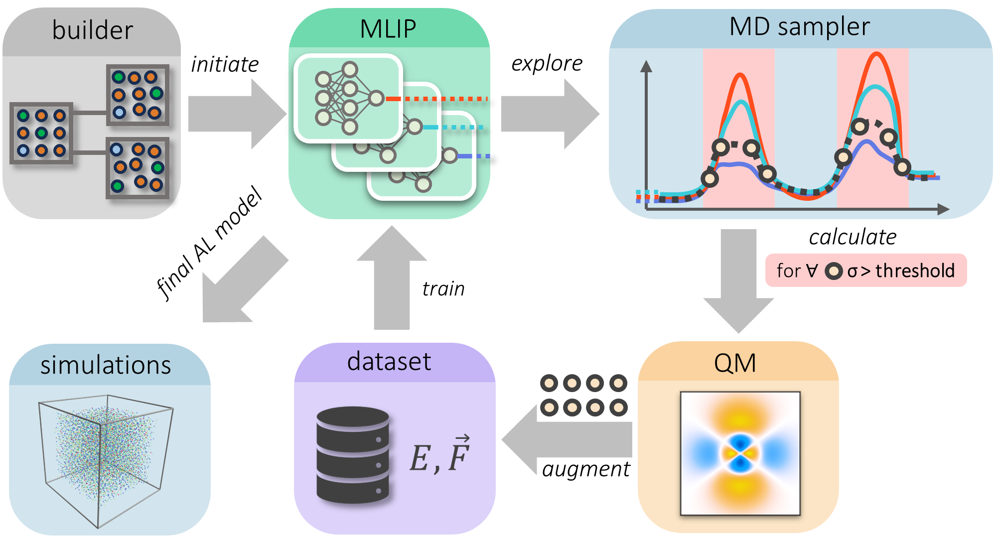

# Active Learning Framework (ALF)

## 📄[Documentation](https://lanl.github.io/ALF/) - *under development*


## 🚀 Overview

This code automates the construction of datasets for machine learned interatomic potentials (MLIP) through active learning. ALF leverages [Parsl](https://parsl-project.org/) framework to automate the job execution allowing active learnming  to iterate on HPC systems without human intervention and bias.
Employing [query by commitee](https://collaborate.princeton.edu/en/publications/query-by-committee) method, ALF trains ensemble of MLIPs (typically 8 NNs) on a bootstrap dataset, runs molecular dynamics to sample chemical space, and marks structures with high uncertainty to be labeled by ground truth method, i.e. recalculated using electronic structure methods such as DFT. Newly labeled structures are appended to the dataset, and process iterates till user-defined convergence. 



ALF breaks the process down into 4 fundamental tasks:
1) system construction (builder)
2) ML interatomic potential training (MLIP)
3) sampling (MD sampler)
4) electronic structure calculations (QM)

The framework uses a general purpose ensembling calculator that enables the tracking of model uncertainty during the training process.

This package is closely interfaced to the Parsl framework which enables task execution through a queueing system or smaller clusters. Some requirements, such as the Parsl resource config file in `alframework/parsl_resource_configs` will need to be modified for your computer system. 

> [!IMPORTANT]
> This code is currently a work in progress, and documentation is still sparse.
> Visit [official ALF docs page](https://lanl.github.io/ALF/)


## 📋 Requirements: 

The requirements for this software are evolving, though generally, they will include the following: 
1) [Parsl](https://parsl-project.org/)
2) [NumPy](https://numpy.org/)
3) [ASE](https://wiki.fysik.dtu.dk/ase/)
4) a QM software package with interface (usually ASE)
5) a ML interatomic potential model - we provide interface to open-source and accurate [HIPPYNN](https://github.com/lanl/hippynn) potential

## ⚙️ Configuration:

To control job flow in the active learning framework, 5 json files are used. The master configuration file controls how all pieces of the framework are assembled and defines where to find the other 4 files. Each of the other 4 files passes inputs to one of the four subtasks enumerated in the first section. To see how these files relate to one another, please see the `examples` folder.

With the json files completed, the `PYTHONPATH` environment variable must be set to the directory where `alframework` is held. Eventually, this step will be replaced by making `alframework` an installable package. 

## 🧪 Testing: 

Once the environment is constructed with the required packages, it is important to test individual operations done by the active learning framework for erorrs. This is done to ensure all processes complete successufuly when run in active learning. Testing each of of the four sub processes is enabled in the following way:

```
python -m alframework master.json --test_builder #Test structure building
python -m alframework master.json --test_sampler #Test mlmd sampling
python -m alframework master.json --test_ml 
python -m alframework master.json --test_qm
```

These functions will execute in such a way as to pass errors back to the front end to enable easier debugging. Errors encountered in the active learning phase.

## ▶️ Execution:

Once each task has been tested, active learning can be started with:
```
python -m alframework master.json
```

It is generally advised to run the master process on a head node inside a terminal multiplexer ([screen](https://www.gnu.org/software/screen/), [tmux](https://github.com/tmux/tmux/wiki), [zellij](https://zellij.dev/about/)) for session persistence. This will allow the ALF master process to continue to run over multiple days/weeks, even after you disconnect. It will automatically interface with the queueing system and run future jobs on compute nodes. 

## 📃 Citations:

If you use ALF in your research, **citations to the papers 1-3 and this repository are mandatory**.
Please, also consider citing other examples below.  

[1] Code release paper and molten salts case study   
*in preparation - link will appear here*

[2] ALF-prouced MLIP for bulk aluminum    
Justin S. Smith, Benjamin Nebgen, Nithin Mathew, Jie Chen, Nicholas Lubbers, Leonid Burakovsky, Sergei Tretiak, Hai Ah Nam, Timothy Germann, Saryu Fensin, Kipton Barros. "Automated discovery of a robust interatomic potential for aluminum" Nat. Comm. 2021,  12, 1257. 
https://doi.org/10.1038/s41467-021-21376-0

[2] Uncertainty-driven dynamics for active learning - UDD sampler     
Nicholas Lubbers, Ying Wai Li, Richard Messerly, Sergei Tretiak, Justin S. Smith, Benjamin Nebgen. "Uncertainty-driven dynamics for active learning of interatomic potentials" Nat. Comp. Sci. 2023, 1968. 
https://doi.org/10.1038/s43588-023-00406-5 

[3] ALF-trained reactive potential for organics    
Shuhao Zhang, Malgorzata Makos, Ryan Jadrich, Elfi Kraka, Kipton Barros, Benjamin Nebgen, Sergei Tretiak, Olexandr Isayev, Nicholas Lubbers, Richard Messerly, Justin Smith. "Exploring the frontiers of chemistry with a general reactive machine learning potential".
https://doi.org/10.26434/chemrxiv-2022-15ct6

[4] Original implementation of ALF and proof of concept study    
Justin S. Smith, Ben Nebgen, Nicholas Lubbers, Olexandr Isayev, Adrian E. Roitberg. "Less is more: Sampling chemical space with active learning". J. Chem. Phys. 2018, 148, 241733.
https://doi.org/10.1063/1.5023802