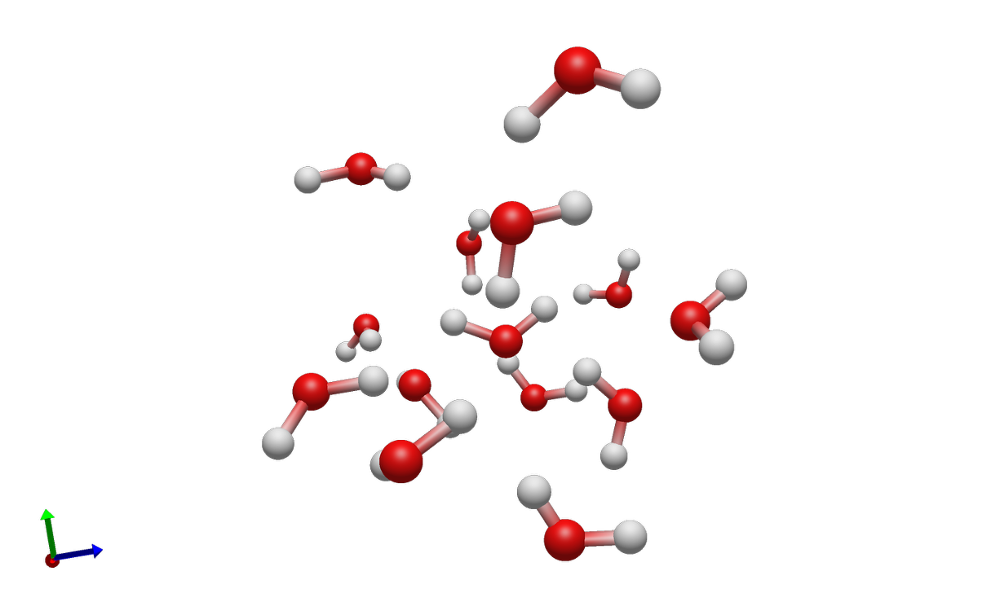

Simple Water Example
====================

The simple water example is a compact ALF workflow for a small molecular (water)
system. It is intended as the first example to copy and adapt when setting up a
new ALF run. The example connects all major ALF stages:

1. Build initial water-containing structures (bootstrapping)
2. Label bootstrap structures with QM engine (ORCA)
3. Train an initial HIPPYNN ensemble from the labeled data.
4. Sample new structures with ML-driven molecular dynamics.
5. Send selected high-uncertainty configurations to ORCA for QM labeling.
6. Store labeled data in HDF5 files.
7. Retrain a HIPPYNN ensemble once the number of high-uncertainty configurations exceeds ``save_h5_threshold``.

The files needed to run the example are located in ``examples/simple_water``.

   A cluster of randomly placed water molecules created by the Builder.

Before You Run
--------------

Configuration files must be modified in order to run the example on your available compute.

* ``orca_config.json`` contains an ORCA executable path. Replace
  ``QM_run_command`` with the ORCA command available on your machine.
* ``master_config.json`` points to a Parsl configuration named
  ``parsl_configs.config_1node``. Edit ``examples/simple_water/parsl_configs.py``
  or point ``parsl_configuration`` to a different resource config for your
  cluster. This file is a placeholder template for Parsl executor, Slurm
  partition, account, QoS, walltime, module, launcher, and worker-count
  settings; it is not a ready-to-run cluster configuration.
* CPU-only resources and GPU ML/sampling resources should usually be
  configured separately. In the template, ORCA/QM tasks use
  ``alf_QM_executor`` while HIPPYNN training and MLMD sampling use
  ``alf_ML_executor`` and ``alf_sampler_executor``.
* HIPPYNN and its ML dependencies must be installed if you run ML training or
  sampling. See :ref:`ml-interface-common-configuration` for the ML task and
  sampler calculator settings. The builder and QM test modes can be used
  separately while bringing up the environment.
* Paths such as ``h5store/``, ``models/``, ``sampling/``, and
  ``orca_scratch/`` are run outputs. Use a clean working directory or
  archive old output before starting a new production run.

See :doc:`../user_guide/parsl` for details on how Parsl resource configuration
maps ALF tasks onto local or HPC resources.

Workflow Stages
---------------

Builder stage
   ``simple_condensed_phase_builder_task`` reads ``builder_config.json`` and
   creates clusters of water molecules using the fragment library. In this example,
   the only fragment is ``fragment_library/water.xyz``.

Sampler stage
   ``simple_mlmd_sampling_task`` reads ``mlmd_config.json`` and drives
    MLMD using a HIPPYNN ensemble. Configurations are selected
   for QM if energy or force uncertainty exceeds the configured cutoffs.

QM stage
   ``orca_calculator_task`` reads ``orca_config.json``, writes ORCA input files,
   runs ORCA, parses requested properties, and returns a labeled
   ``MoleculesObject``.

ML stage
   ``train_HIPPYNN_ensemble_task`` reads ``hippynn_config.json`` and trains a
   HIPPYNN model ensemble from the HDF5 data written by ALF. See
   :doc:`../user_guide/ml_interfaces` for the general ML interface pattern.

Recommended Bring-Up Commands
-----------------------------

Run the stages one at a time before starting a full active-learning loop. From
the ``examples/simple_water`` directory:

.. code-block:: bash

   python -m alframework --master master_config.json --test_builder
   python -m alframework --master master_config.json --test_qm
   python -m alframework --master master_config.json --test_ml
   python -m alframework --master master_config.json --test_sampler

The test modes use ``parsl_debug_configuration`` when it is provided in the
master config. This lets you keep a smaller, faster Parsl configuration for
environment checks.

After the individual stages work, start the active-learning loop:

.. code-block:: bash

   python -m alframework --master master_config.json

ALF writes ``status.txt`` and then continues running the active-learning loop,
periodically printing queue status for builder, sampler, QM, and ML tasks.

Batched Builder Variant
-----------------------

After the base simple water example is working, the next example to try is the
batched-builder variant in ``examples/simple_water_multi_builder``. It builds
the same kind of condensed-phase water boxes with the same builder, sampler,
QM, and ML settings, but changes how many initial structures each builder task
returns.

The base ``examples/simple_water`` run uses
``simple_condensed_phase_builder_task``. Each builder task returns one generated
water box, and ALF sends that structure to one sampler task.

The ``examples/simple_water_multi_builder`` run uses
``simple_multi_condensed_phase_builder_task``. Each builder task returns a list
of generated water boxes, and ALF starts a sampler task for each structure in
that list. In the provided config, ``maximum_builder_structures`` is set to
``5``, so each builder task creates five independent initial candidates.

To run the batched variant, use the same staged bring-up commands from the
``examples/simple_water_multi_builder`` directory:

.. code-block:: bash

   python -m alframework --master master_config.json --test_builder
   python -m alframework --master master_config.json --test_qm
   python -m alframework --master master_config.json --test_ml
   python -m alframework --master master_config.json --test_sampler
   python -m alframework --master master_config.json

This variant is useful when builder overhead is significant or when you want a
single builder submission to feed multiple sampler tasks. It does not change the
chemical system being built; it only changes the builder task throughput.

Expected Outputs
----------------

During staged checks and full runs, expect these files and directories:

.. list-table::
   :header-rows: 1
   :widths: 30 70

   * - Path
     - Purpose
   * - ``status.txt``
     - Restart and progress state, including current model/data ids and failed
       task counters.
   * - ``h5store/data-*.h5``
     - Stored labled data batches from converged QM results.
   * - ``models/model-*``
     - Directories containing trained HIPPYNN ensembles.
   * - ``sampling/metadata-*.p``
     - Per-sampling-task metadata, including uncertainty, temperature, density,
       and final structure information.
   * - ``orca_scratch/``
     - QM scratch directory containing per-molecule ORCA run directories.
   * - ``status_plots/``
     - Optional plots created by the configured plotting utility.

Master Configuration
--------------------

``master_config.json`` connects the stages and controls the active-learning
loop.

.. list-table::
   :header-rows: 1
   :widths: 28 72

   * - Field
     - Meaning
   * - ``master_directory``
     - Base directory for relative paths. ``"pwd"`` means the directory
       containing the master config.
   * - ``*_config_path``
     - Paths to the builder, sampler, QM, and ML JSON files.
   * - ``builder_task``, ``sampler_task``, ``QM_task``, ``ML_task``
     - Import strings for the Python task functions ALF will submit through
       Parsl.
   * - ``properties_list``
     - Maps ALF result names to HDF5 dataset names, property scope, and unit
       conversion factor.
   * - ``h5_path``
     - Output pattern for stored training data, such as
       ``h5store/data-0000.h5``.
   * - ``model_path``
     - Output pattern for trained models, such as ``models/model-0000``.
   * - ``target_queued_QM``, ``minimum_QM``, ``save_h5_threshold``
     - Queue thresholds controlling when ALF launches QM tasks and stores new
       labeled data.
   * - ``parallel_samplers``
     - Target number of builder/sampler candidates ALF tries to keep active.
       This is a queue-depth target, not the number of GPUs or nodes requested.
   * - ``bootstrap_set``
     - Number of initial QM labels to collect before the first model training.
   * - ``parsl_configuration``
     - Import string for the production Parsl config.
   * - ``parsl_debug_configuration``
     - Import string for the smaller config used by stage test modes.
   * - ``QM_scratch_dir``
     - Directory for QM input, output, and scratch subdirectories.

Queue Depth And Resource Concurrency
------------------------------------

``target_queued_QM`` controls how much QM work ALF tries to keep queued, but
it does not by itself request more CPU nodes. During bootstrap, ALF first has
to generate structures with the builder; ``parallel_samplers`` controls how
many builder/sampler candidates ALF tries to keep active. The QM executor in
``parsl_configs.py`` then controls how many queued QM tasks can actually run,
through settings such as ``max_blocks``, ``nodes_per_block``, and
``max_workers_per_node``.

For example, if the QM executor uses ``nodes_per_block=1``,
``max_blocks=10``, and ``max_workers_per_node=1``, Parsl may request up to ten
one-node QM allocations. ALF will only fill those allocations if enough
structures have been generated and enough QM tasks are queued. Likewise,
``gpus_per_node`` tells ALF how sampler workers map onto GPUs, while the
sampler executor's worker and block settings determine how many sampler tasks
can run at once.

Builder Configuration
---------------------

``builder_config.json`` controls initial structure construction.

.. list-table::
   :header-rows: 1
   :widths: 28 72

   * - Field
     - Meaning
   * - ``molecule_library_path``
     - Directory containing fragment files, relative to the example directory.
   * - ``solute_molecule_options``
     - Fragment combinations that may be placed as solutes. The water example
       uses one water molecule.
   * - ``solvent_molecules``
     - Solvent fragment names and sampling weights.
   * - ``cell_range``
     - Minimum and maximum box lengths for each cell direction.
   * - ``Rrange``
     - Density or packing range used by the condensed-phase builder.
   * - ``min_dist``
     - Minimum allowed distance between generated structures.
   * - ``max_patience``
     - Number of placement attempts before the builder gives up.
   * - ``center_first_molecule``
     - Whether to center the first molecule, useful for solute-centered systems.
   * - ``shake``
     - Random coordinate perturbation applied to generated structures.

Sampler Configuration
---------------------

``mlmd_config.json`` controls uncertainty-driven MD sampling.

.. list-table::
   :header-rows: 1
   :widths: 28 72

   * - Field
     - Meaning
   * - ``dt``, ``maxt``
     - MD timestep in femtoseconds and maximum simulation time in picoseconds.
   * - ``Escut``, ``Fscut``
     - Energy and force uncertainty thresholds for selecting configurations for
       QM labeling.
   * - ``Ncheck``
     - Number of MD steps between uncertainty checks.
   * - ``srt_temp``, ``end_temp``
     - Ranges for starting and ending temperatures.
   * - ``amp_temp``, ``per_temp``
     - Ranges for temperature fluctuation amplitude and period.
   * - ``end_dens``, ``amp_dens``, ``per_dens``
     - Density target and fluctuation controls. ``null`` disables density
       changes in this example.
   * - ``meta_dir``
     - Directory for sampler metadata files.
   * - ``ase_calculator``
     - Import string for the ML ensemble calculator loader.
   * - ``MLMD_calculator_options``
     - Extra calculator options, such as the soft wall potential.
   * - ``trajectory_frequency``, ``trajectory_interval``
     - Controls optional trajectory writing during sampling.

ORCA Configuration
------------------

``orca_config.json`` controls QM labeling through ORCA.

.. list-table::
   :header-rows: 1
   :widths: 28 72

   * - Field
     - Meaning
   * - ``QM_run_command``
     - ORCA executable or launch command. Replace this path for your system.
   * - ``ncpu``
     - CPU count passed to the ORCA interface when applicable.
   * - ``orca_env_file``
     - Optional shell environment file sourced before ORCA execution.
   * - ``orcasimpleinput``
     - ORCA method, basis, and job keywords.
   * - ``orcablocks``
     - Additional ORCA input blocks, such as memory, SCF, and property blocks.
   * - ``Ediff``, ``Fdiff``
     - Thresholds used by double-calculation checks when using the double ORCA
       task.

HIPPYNN Configuration
---------------------

``hippynn_config.json`` controls model architecture, training, and data
filtering. The broader HIPPYNN and new-backend configuration pattern is
described in :doc:`../user_guide/ml_interfaces`.

.. list-table::
   :header-rows: 1
   :widths: 28 72

   * - Field
     - Meaning
   * - ``n_models``
     - Number of models in the ensemble.
   * - ``energy_key``, ``force_key``, ``coordinates_key``, ``species_key``
     - HDF5 dataset names used for training.
   * - ``network_params``
     - HIPPYNN architecture settings, including species, feature counts,
       distance cutoffs, and layer counts.
   * - ``*_loss_weight``
     - Relative weights for energy, force, and regularization losses.
   * - ``valid_size``, ``test_size``
     - Fractions of data reserved for validation and test splits.
   * - ``learning_rate``
     - Initial optimizer learning rate.
   * - ``scheduler_options``
     - Learning-rate scheduler behavior, such as patience and decay factor.
   * - ``controller_options``
     - Training loop options, including batch size, maximum epochs, and early
       termination patience.
   * - ``device_string``
     - Device selection behavior for training tasks.
   * - ``remove_high_*``
     - Optional data filtering thresholds before training.

Adapting The Example
--------------------

For a new molecular system, start by replacing the fragment library and builder
configuration. Then update the QM method and executable path. Once the builder
and QM tests work, tune the sampler thresholds and ML architecture for the
target chemistry. Finally, update the Parsl configuration so the QM, ML, and
sampler tasks request resources that match the software and hardware used on
your cluster.
