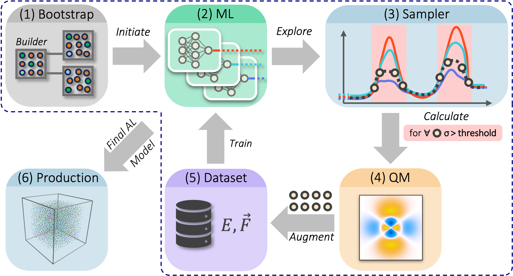
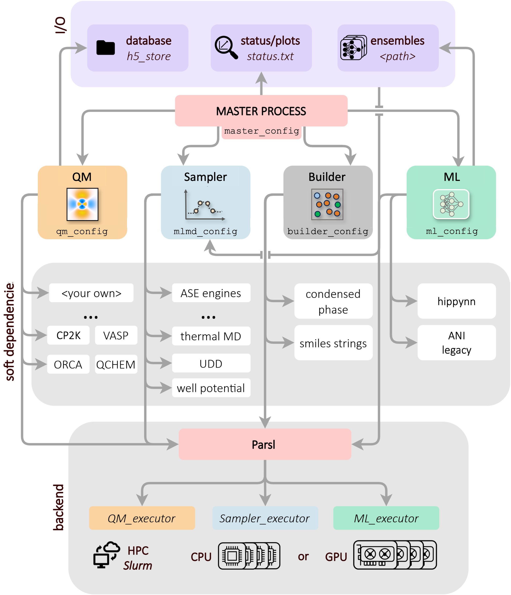

What Is ALF
===========

The **Active Learning Framework (ALF)** automates the construction of structurally diverse datasets for
machine learning interatomic potentials (MLIPs) using a query by committee (QBC) active-learning approach.

At a high level, ALF coordinates four core modules:

* **System construction (Builders)**
* **Sampling (Samplers)**
* **ML model training (ML interfaces)**
* **Electronic structure calculations (QM interfaces)**

**These modules are used to perform the main ALF workflow:**

1. Build initial structures (bootstrapping) and label with a QM engine of choice. This step accomplishes initial sampling of the conformational/chemical space.
2. Train an initial MLIP ensemble from the labeled data.
3. Sample new structures with ML-driven molecular dynamics.
4. Send selected high-uncertainty configurations to QM engine for labeling.
5. Store labeled data in HDF5 files.
6. Retrain ML ensemble once the number of high-uncertainty configurations exceeds a user-defined threshold. Repeat until no high-uncertainty
   frames are identified, or the number of ALF iterations is exceeded. Use final MLIP to perform down-stream production task (Not part of ALF).

   Core ALF workflow from initial sampling (bootstrapping) to production-ready MLIP.

Overview of the workflow
------------------------

ALF uses a master process to orchestrate tasks and data flow between the core
stages. The process is typically launched with:

.. code-block:: bash

   python -m alframework --master master.json

The ``master.json`` file points to the other configuration files and task
definitions needed for each stage. In practice, ALF uses five JSON files:

1. Master configuration
2. Builder configuration
3. Sampler configuration
4. ML configuration
5. QM configuration

   Overview of ALF's code structure.

How each iteration works
------------------------

During an iteration, ALF builds candidate structures, samples configurations
using the current ML model ensemble, evaluates selected structures with QM,
and stores the resulting data for retraining. The newly trained models are then
used in the next sampling cycle.

This loop is designed to run for many iterations with minimal user
intervention.

Execution model
---------------

ALF is integrated with Parsl for task execution, so jobs can be launched on
local resources or queued cluster resources depending on your Parsl config.
Resource profiles are defined in ``alframework/parsl_resource_configs`` and
can be customized for your system.

Testing individual stages
-------------------------

Before long runs, ALF supports stage-level checks:

.. code-block:: bash

   python -m alframework --master master.json --test_builder
   python -m alframework --master master.json --test_sampler
   python -m alframework --master master.json --test_ml
   python -m alframework --master master.json --test_qm

These tests validate each stage independently before running the full active
learning workflow.
